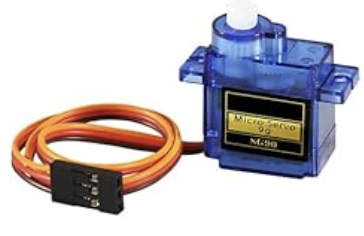

# Continuous Servo

**Purpose:** sensor used to determine when the toilet is "in-use"

  

**Purchase Link:** 
- [SG90 Micro Servo Motor 9g](https://www.amazon.com/Dorhea-Arduino-Helicopter-Airplane-Walking/dp/B07Q6JGWNV)

**ESP32 Pins:** 
- SG90 Red Wire --> + Terminal
- SG90 Orange Wire --> - Terminal
- SG90 Brown Wire --> ESP32 GPIO 13

**Description:**

The servo motor is used to control the rack and pinion track for the ESP32's respective toilet. Note that the servo motor is only required for the Poolantir Diorama; if creating a standalone module to retrofit a toilet, this serves (pun not intended) no purpose.