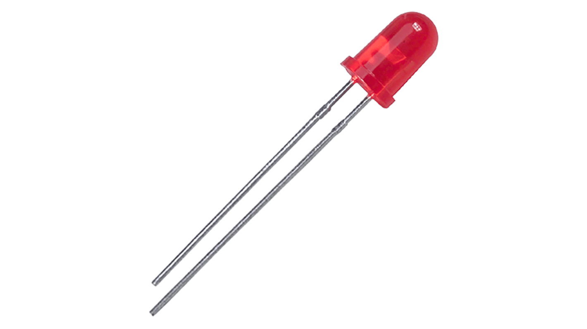

# Status LEDs

**Purpose:** Indicators for WiFi/Bluetooth mode and if toilet is "in-use"

  

**Purchase Link:** 
- N/A

**ESP32 Pins:** 
- In-Use Indicator LED --> ESP32 GPIO 4
- WiFi Indicator LED --> ESP32 GPIO 16
- BlueTooth Indicator LED --> ESP32 GPIO 17

_Note:_ these LEDs require resistors. Poolantir system is using 330ohms.

**Description:**

These LEDs simply toggle on when the state of the pin is 1. Note that our project primarly uses WiFi to communicate with our Raspberry Pi gateway. When this connection fails, Bluetooth is used. Because of this there should never a time when both LEDs will be toggled on.
