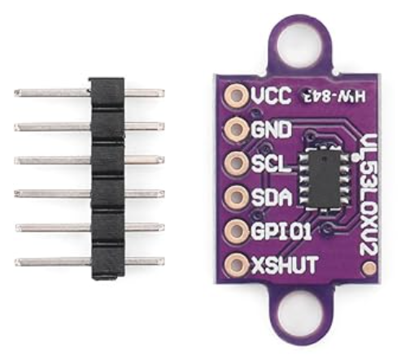

# Time of Flight (ToF) Sensor

**Purpose:** sensor used to determine when the toilet is "in-use"

  

**Purchase Link:** 
- [Starry-VL53L0x Time of Flight Sensor](https://www.amazon.com/Starry-VL53L0X-Breakout-GY-VL53L0XV2-Measurement/dp/B0DZWS6WC5/ref=sr_1_2_sspa?crid=ABEVADUCB1C4&dib=eyJ2IjoiMSJ9.NynomTYOoKcipp_Mp_ni9_rOwgXz6ES4KuS6zrtRCAY6YATJr5LQZYHzrbOMeTjPWXcucHkL6l9ne6tRhsMGeE9phChrBr3izl05TPUdcdy6Kw6DGzR_KCltCSfESjlSuysns0rOgBG9utYp-nCEmTbkMyw4HalyRRUdm-YzMqgYvT7dOymInOjzPNjlvoB5Fp_Ks7xKVrW3sJytXR4EgRtn2NpN1kjMKv5rweyXy68.UIQ65hEfzNj9KKmUgVpcCKKJAkKWhUTR64w8UbbvX0E&dib_tag=se&keywords=time+of+flight+sensor&qid=1772749735&sprefix=time+of+flight+senso%2Caps%2C174&sr=8-2-spons&sp_csd=d2lkZ2V0TmFtZT1zcF9hdGY&psc=1)

**ESP32 Pins:** 
- ToF VCC --> + Terminal
- ToF GND --> - Terminal
- ToF SCL --> ESP32 D21
- ToF SDA --> ESP32 D22

_Unused ToF Pins:_
- ToF GPIO1
- ToF XSHUT

**Description:**

The ToF module is used to sense whether or not a user is standing within the _"pissing distance"_. As the Poolantir system was simulated on an extremely scaled-down diorama, this distance is not an accurate representation. For our purposes, we have set this distance to 50mm. 