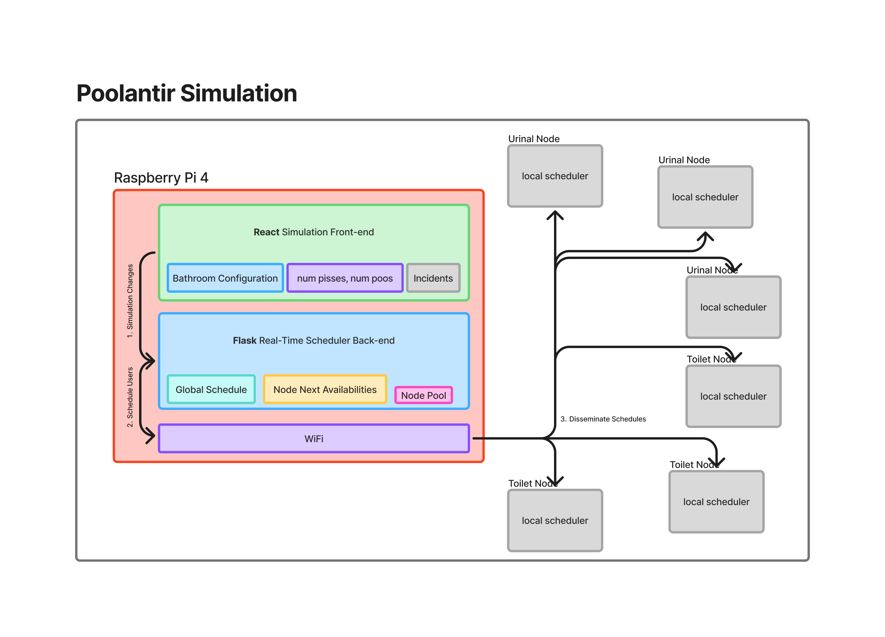

# Source Files

| File | Purpose | PlatformIO Environment |
|------|---------|------------------------|
| `main.cpp` | Main application (ToF, LEDs, servo) | `poolantir_simulation` |
| `bluetooth_test.cpp` | Bluetooth connectivity test | `bluetooth_test` |
| `wifi_test.cpp` | WiFi connectivity test | `wifi_test` |
| `servo_test.cpp` | Servo sweep test | `servo_test` |
| `tof_test.cpp` | Time-of-Flight sensor test | `tof_test` |

Each test file is built by its own environment; see `platformio.ini` for details.

> Keep `test/` and these `*_test.cpp` files in sync when editing tests.

---

# Simulation Logic

### Setup

1. **User configures bathroom layout** (Raspberry Pi) -- The user selects the starting urinals and stalls via the frontend.

### Loop

2. **Mark out-of-order fixtures** (Raspberry Pi) -- A human selects whether a toilet has an incident and is out-of-order or able to be used.
3. **Queue new toilet requests** (Raspberry Pi) -- A human adds new toilet requirements, selecting the number of stall uses, urinal uses, and arrival times.
4. **Run the scheduler** (Raspberry Pi) -- The scheduler determines which toilet will be used by which user.
5. **Send schedule to ESP32** (Raspberry Pi -> ESP32 #n) -- The Raspberry Pi sends Toilet #n's schedule over Bluetooth to the ESP32 controlling that toilet's servo.
6. **Simulate usage** (ESP32 #n) -- The ESP32 follows the schedule, moving the servo-driven figurine into ToF range for each use. This is how occupancy data is collected.
7. **Report back** (ESP32 #n -> Raspberry Pi) -- Usage count and timestamps are sent back to the Raspberry Pi for data collection and upload to Firebase Firestore.

#### ESP32 Logic Loop
1. Listen to incomming BlueTooth transmissions from the Raspberry Pi
2. As restrooms operate in a FIFO fashion, a queue can be used to store integers denoting which type of restroom usage it is. Pee: "1" and Poo: "2". We assume average 20 seconds for "1" and 5:00 minutes (300 seconds) for "2". For simulation purposes these times are scaled down by 10. "1" is now 2 seconds and "2" 30 seconds.
3. The simulation consumes the restroom usage at the first position of the queue and rotates the servo into position to begin usage i.e. 50mm away from ToF sensor. Once the usage begins, the LED indicator "in-use" will light up. Depending on whether "1" or "2" the servo will remain in front of the sensor for 2 seconds or 30 seconds before returning to its initial position. Once the ToF sensor detects the "in-use" to "not-in-use" logic shift, it will transmit the data to the Raspberry Pi to be handed off to the Firebase Firestore.

### Modes of Operation
As this project features a physical simulation (driven by servos), however this is not how the device is intended to be used. The Poolantir system is designed such that the device can be retro-fitted to any toilet and work seamlessly given there is a gateway device. 
For this reason, there is both a "simulation" and "normal" mode. This will be toggled via a BlueTooth signal from the Raspberry Pi. 